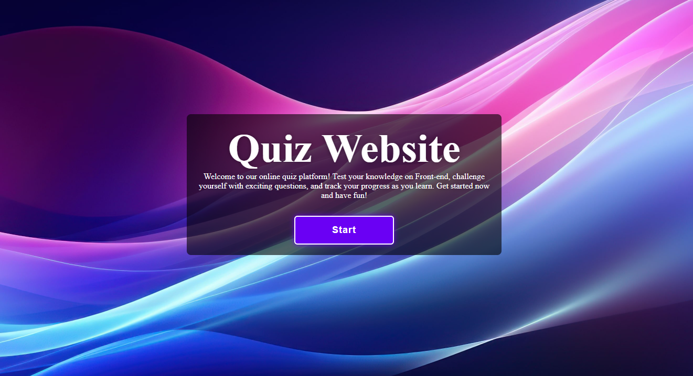
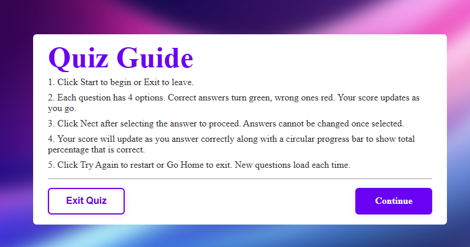
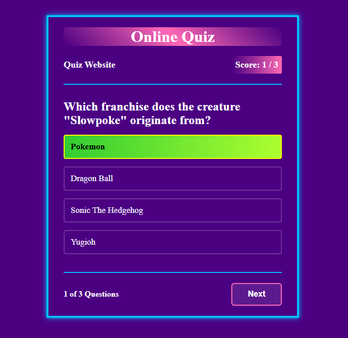
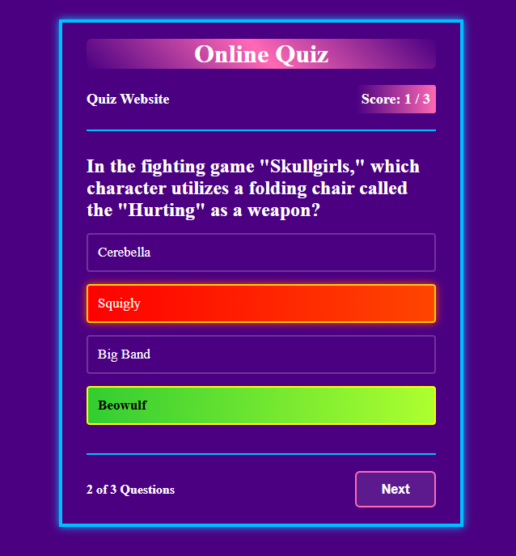
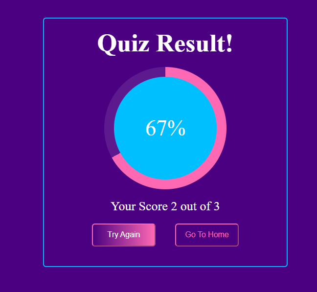

# Quiz App

This is a simple interactive quiz application built using HTML, CSS, and JavaScript. The app fetches quiz questions from an API, allows users to answer them, and calculates the score. It includes functionality for starting the quiz, answering questions, viewing results, and retrying the quiz.

## Demo











## Functionality Overview

### 1. Fetching Questions
The quiz questions are fetched from the Open Trivia Database API. The app fetches a set of 3 random multiple-choice questions from the "General Knowledge" category (you can modify this if you want to change the category or number of questions).

### 2. Quiz Flow
- The app starts by showing a start button. When clicked, the quiz section is revealed.
- The user is presented with one question at a time, with randomized options.
- After answering a question, the app displays whether the answer was correct or incorrect and disables further     options.
- Once all questions are answered, a result box appears showing the user's score.
- The user can retry the quiz, and the app will fetch a new set of questions.

### 3. Preventing Scroll and Inputs
- The app prevents scrolling via mouse, trackpad, and keyboard arrow keys/space bar while the quiz is active to provide a focused experience.

## Features

- Fetches random quiz questions from the [Open Trivia Database API](https://opentdb.com/).
- Displays multiple-choice questions with randomized options.
- Tracks user progress and displays the score.
- Allows users to retry the quiz after completion.

## Technologies Used

- **HTML**: Markup for structuring the content of the quiz.
- **CSS**: Styling for the quiz interface and animations.
- **JavaScript**: Handles the quiz logic, including fetching questions from the API, displaying them, and calculating the score.

### Running the Quiz

1. **Start the Quiz**: Click on the "Start" button to open the quiz interface.
2. **Answer the Questions**: Select the options for each question.
3. **View Results**: After answering all questions, the result box will show your score.
4. **Retry**: You can click "Try Again" to restart the quiz with new questions.

## Code Explanation

### JavaScript

1. **Fetch Questions**: 
   The `fetchQuestions` function fetches quiz data from the Open Trivia Database API and processes it into a suitable format for the quiz.

2. **Shuffle Questions and Options**:
   The `shuffleArray` function randomizes the order of questions and answer options to ensure a varied experience each time.

3. **Event Listeners**:
   Event listeners are added to buttons for starting the quiz, moving to the next question, and retrying the quiz. Additionally, listeners are added to prevent scrolling during the quiz.

4. **Tracking and Displaying Score**:
   The `headerScore` function updates the displayed score, and the `showResultBox` function shows the final score at the end of the quiz.

### CSS

- Styling is provided for the quiz interface, including the main layout, buttons, and result display.
- Transitions and animations are used to smoothly reveal different sections of the quiz.

### Prerequisites

- A modern web browser (e.g., Google Chrome, Mozilla Firefox).
- A text editor or IDE (e.g., Visual Studio Code) for editing the files.

### Installation

1. Clone or download the project files:
    ```bash
    git clone https://github.com/SabKaz78614/Online-Quiz.git
    ```

2. Open the project folder in your code editor.

3. Open `index.html` in your browser to run the quiz.


